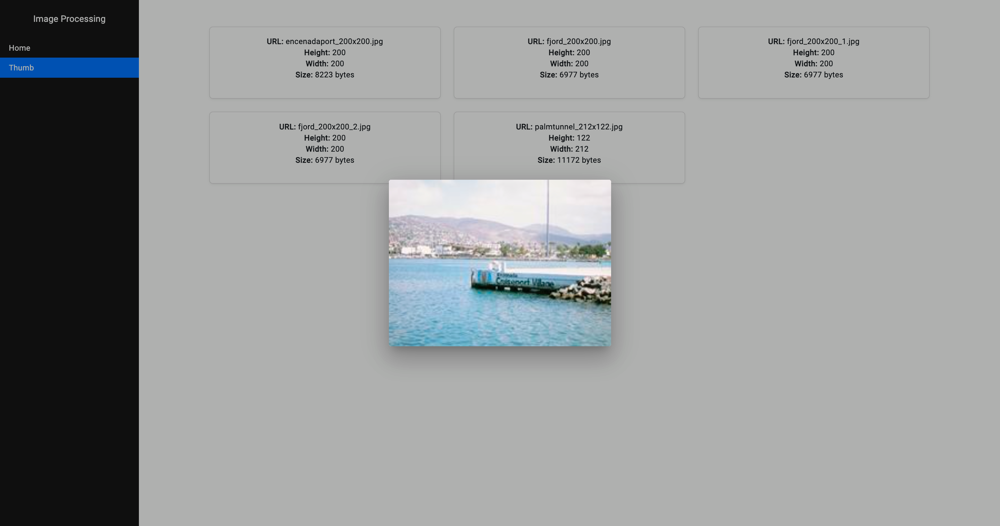
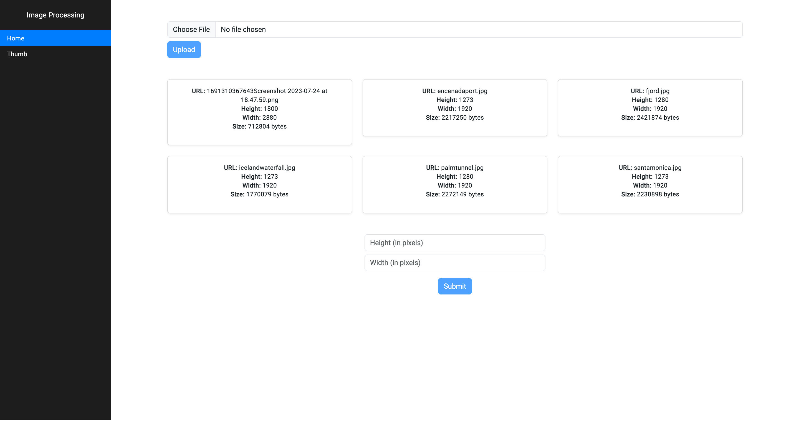

# My Project
This repository contains the code for my web application. It has a Node.js/Express backend API and an Angular frontend.

## Running the app
First, install all dependencies:

```bash 
cd back-end
npm install

cd front-end/image-processing
npm install
```

To run test:
```agsl
npn run test
```

To run linting:
```agsl
npm run lint
```

Then, you can run the backend API:

```bash 
cd back-end
npm run start:prod
```

This will run the Node server on port 3000.

In another terminal window, run the Angular frontend:

```bash 
cd front-end/image-processing
ng s
```

This will run the Angular dev server on port 4200.

You can now access the app locally at http://localhost:4200

The API endpoints will be available at http://localhost:3000

Technologies
```agsl
Node.js/Express - Backend API
Angular - Frontend
```

### DEMO

- A valid api will look like: 
```agsl
http://localhost:3000/api/image?imageId=fjord.jpg&width=200&height=200
```
response will be : ```{"message":"ok"}``` to verify please access FE click on card to se image.



### Basic UI for upload and resize images.

